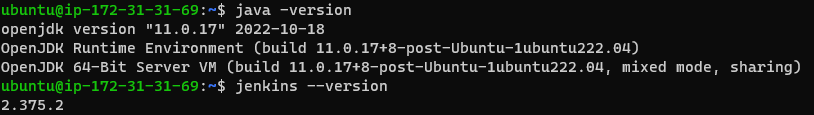
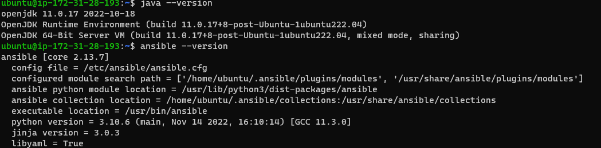

Ansible jenkin inegration trough apache
----------------------------------------

* Create ubuntu instance ec2 instance
* login instance
* install java11 in ubuntu [Refer hear](https://www.digitalocean.com/community/tutorials/how-to-install-java-with-apt-on-ubuntu-22-04) for instation java11
* for java install steps

'''
sudo apt update 
sudo apt install openjdk-11-jdk -y 
java -version 
'''
* 

* install ansible
* create e2 instance
* install java and asbile in the instance
* [Refer hear](https://www.digitalocean.com/community/tutorials/how-to-install-and-configure-ansible-on-ubuntu-20-04) for ansible installation
* 

